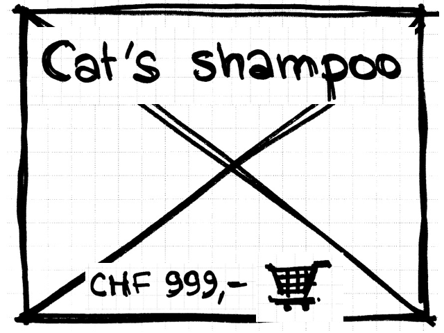
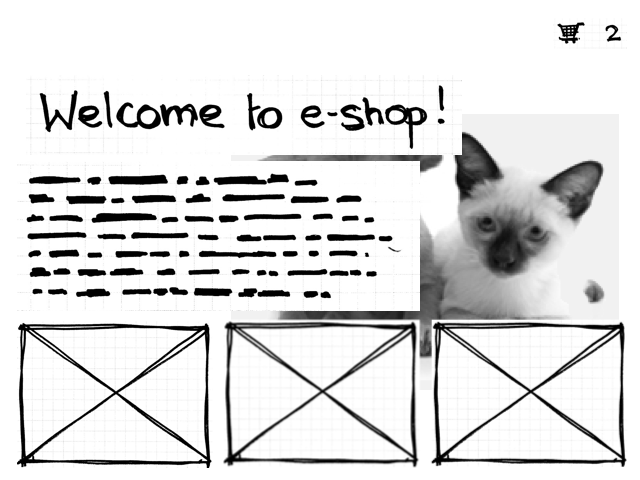
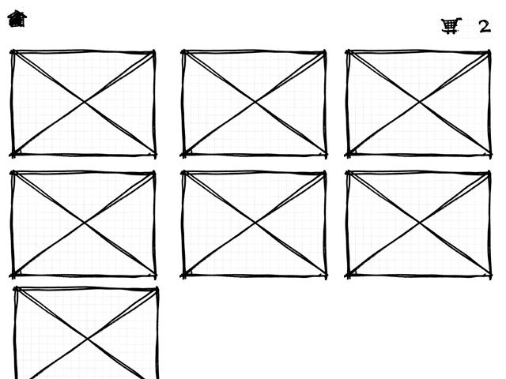
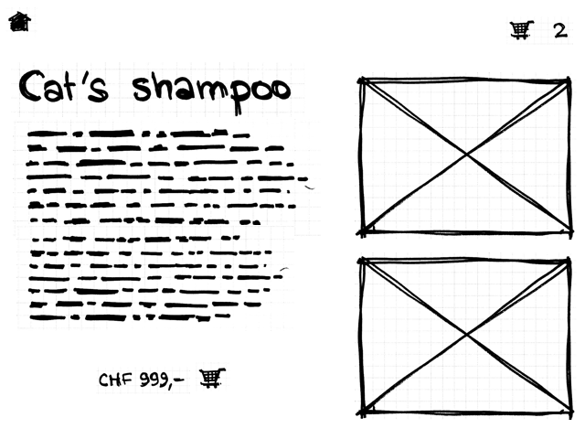
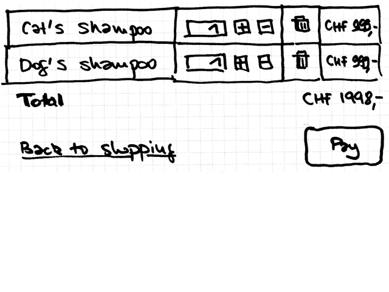

== Objectif

L'objectif est la réalisation d'un magasin de vente en ligne.

TIP: Afin de conserver une charge de travail adaptée, toutes les fonctionnalités attendues d’une telle application ne sont pas à implémenter, mais uniquement celles qui sont décrites dans le présent document.

== Aperçu de la navigation entre les écrans

[.text-center]
[plantuml, navigation-flow, svg]
....
state "Accueil" as welcome
state "Liste des produits" as list
state "Détail produit" as detail
state "Checkout" as checkout
state "Paiement" as payment
[*] --> welcome
welcome --> list: Clic sur le titre \nou la description
welcome --> detail: Clic sur un composant produit
list --> detail: Clic sur un composant produit
detail --> checkout: Clic sur le caddie
list --> checkout: Clic sur le caddie
checkout --> checkout: Modification des quantités \nSuppression de ligne produit
checkout --> payment: Clic sur le bouton Payer
checkout --> list: Clic sur Retourner au magasin
payment --> welcome: Clic sur le bouton Commander
payment --> list: Clic sur Retourner au magasin
....

== Composant partagé : barre de menu

=== Composants

[options="header"]
|===

| Composant | Type | Commentaire

| Caddie | link:#_composant_partagé_caddie[Composant caddie] | Aligné à droite
| Accueil | Icône | Aligné à gauche

|===

=== Comportement

* Lorsque l'icône d'accueil est cliqué, la page d'accueil est affichée
* Lorsque l'icône de caddie est cliqué, la page de checkout est affichée
* Le composant barre de menu est affiché sur toutes les pages, sauf la page de checkout ou la page de paiement

== Composant partagé : caddie

=== Composants

[options="header"]
|===

| Composant | Type | Commentaire

| Caddie | Image | Aligné à gauche
| Nombre d'articles dans le caddie | Texte | Aligné à droite

|===

=== Comportement

* Le composant caddie affiche le nombre de produits dans le caddie de l'utilisateur
* Lorsqu'un produit est ajouté au caddie, le nombre de produits doit être rafraîchi
* Lorsqu'un produit est supprimé du caddie, le nombre de produits doit être rafraîchi

== Composant partagé : produit

[.text-center]

=== Composants

[options="header"]
|===

| Composant | Type | Commentaire

| Nom | Texte | Centré
| Image | Image | En arrière-plan
| Ajouter au caddie | Bouton | Affiche le prix et l'icône Caddie

|===

=== Comportement

* Lorsque le bouton est cliqué, le produit est ajouté au caddie
* Lorsque l'utilisateur clique n'importe où sauf sur le bouton, l'link:#_ecran_de_détail_du_produit[écran de détail du produit] est affiché

== Ecran d'accueil

[.text-center]

=== Composants

[options="header"]
|===

| Composant | Type | Commentaire
| Caddie | link:#_composant_partagé_caddie[Composant caddie] |
| Titre | Texte |
| Description | Texte | Multi-lignes
| Image | Image | En arrière-plan
| Produit 1 | link:##_composant_partagé_produit[Composant produit] |
| Produit 2 | link:##_composant_partagé_produit[Composant produit] |
| Produit 3 | link:##_composant_partagé_produit[Composant produit] |

|===

=== Comportement

* Lorsque le titre ou la description sont cliqués, l'utilisateur est redirigé vers l'link:#_ecran_de_liste_de_produits[écran de liste des produits]

== Ecran de liste de produits

[.text-center]

=== Composants

[options="header"]
|===

| Composant | Type | Commentaire

| Menu | link:#_composant_partagé_barre_de_menu[Composant barre de menu] |
| Produit i | link:##_composant_partagé_produit[Composant produit] |

|===

* Tous les produits sont affichés
* La barre de défilement du navigateur permet de visualiser les produits qui se situent en dehors du cadre

== Ecran de détail du produit

[.text-center]

=== Composants

[options="header"]
|===

| Composant | Type | Commentaire

| Menu | link:#_composant_partagé_barre_de_menu[Composant barre de menu] |
| Nom | Texte |
| Description | Texte |
| Visuel 1 | Image | Aligné à droite
| Visuel 2 | Image | Aligné à droite
| Ajouter au caddie | Bouton | Affiche le prix et l'icône Caddie

|===

=== Comportement

* Lorsque le bouton est cliqué, le produit est ajouté au caddie

== Ecran de checkout

[.text-center]

=== Composants

[options="header"]
|===

| Composant | Type | Commentaire

| Produit i | Ligne de tableau |
| Total | Texte | Affiche la somme du prix de chaque ligne
| Retour au magasin | Lien |
| Payer | Bouton

|===

Une ligne de tableau comporte :

* Le libellé du produit
* La quantité commandée
* Un bouton btn:[+]
* Un bouton btn:[-]
* Un bouton btn:[Supprimer]
* Le prix du produit fois la quantité

=== Comportement

* Lorsque la quantité d'un produit est modifiée, le prix de la ligne produit est modifié
* Lorsque le prix de la ligne produit est modifié, le prix total est modifié
* Lorsque le bouton btn:[Supprimer] est cliqué, la ligne produit est supprimée
* Lorsque la ligne produit est supprimée, le prix total est modifié
* La quantité ne peut jamais être inférieure à 1
* Lorsque le bouton btn:[+] est cliqué, la quantité de la ligne produit augmente de 1
* Lorsque le bouton btn:[-] est cliqué, la quantité de la ligne produit diminue de 1
* Lorsque le bouton btn:[Payer] est cliqué, l'utilisateur est redirigé vers l'link:#_ecran_de_paiement[écran de paiement]
* Lorsque le lien Retour au magasin est cliqué, l'utilisateur est redirigé vers l'link:#_ecran_de_détail_du_produit[écran de liste des produits]

== Ecran de paiement

=== Composants

[options="header"]
|===

| Composant | Type

| Somme | Texte
| Nom | Champ de texte
| Email | Champ de texte
| N° de carte de paiement | Champ de texte
| Mois de fin de validité | Champ numérique sur 2 positions
| Année de fin de validité | Champ numérique sur 2 positions
| Retour au magasin | Lien
| Commander | Bouton

|===

=== Comportement

* Lorsque le lien Retour au magasin est cliqué, l'utilisateur est redirigé vers l'link:#_ecran_de_détail_du_produit[écran de liste des produits]
* Lorsque le bouton Commander est cliqué :

** Le caddie est vidé
** L'utilisateur est redirigé vers l'link:#_ecran_daccueil[écran d'acceuil]
** Le message "Merci pour votre commande" s'affiche
